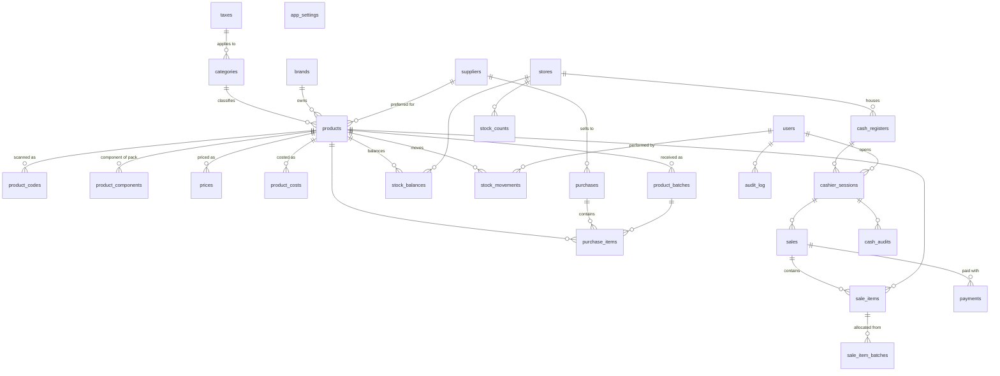

# 02. Data Model

## 1. Purpose & Conventions

This document defines the authoritative relational model for **Elman-U POS**. It is the single source of truth from which PostgreSQL migrations (DDL) will be generated 1:1.

**Naming convention:** English lowercase, `snake_case` for identifiers. Tables are plural nouns; foreign keys use the referenced table's singular + `_id`.

**Type conventions:**
| Domain | Type | Rationale |
|---|---|---|
| Money | `NUMERIC(12,2)` | Arbitrary precision, satisfies **BR-01**. Floating point is prohibited. |
| Quantity / weight | `NUMERIC(12,3)` | Supports kg / liter / fractional units (0.300 kg of cold cuts). |
| Timestamps | `TIMESTAMPTZ` | UTC storage, avoids timezone ambiguity. |
| Primary keys | `BIGSERIAL` | Sequential surrogate keys (except `stock_balances`, see §4.7). |
| Status / fixed vocabulary | `ENUM` (PostgreSQL) | Enforces allowed values at engine level (**NFR-02**). |

**Design pillars** (each maps to a business rule from `01-domain-and-requirements.md`):
- **P-01 — Immutable ledger:** All inventory change flows exclusively through `stock_movements` (append-only, no `UPDATE`/`DELETE`). `stock_balances` is a cached, transactionally-maintained aggregate (**BR-05**).
- **P-02 — Price/cost snapshot:** `sale_items` copies `unit_price` and `unit_cost` at sale time; price/cost history lives in dedicated tables with `valid_from` (**BR-03**).
- **P-03 — Atomicity:** Sale, purchase, and count-confirmation each execute inside one `BEGIN...COMMIT` transaction, updating balances and inserting movements atomically (**BR-04**).
- **P-04 — FIFO lot allocation:** Lot-controlled products consume stock from the oldest remaining batch; one sale line may span multiple batches via `sale_item_batches`.

---

## 2. Entity Relationship Overview



---

## 3. Enumerations (PostgreSQL `ENUM`)

```sql
CREATE TYPE product_sale_type    AS ENUM ('UNIT', 'WEIGHT', 'COMPOSITE');
CREATE TYPE product_code_type    AS ENUM ('EAN13', 'EAN8', 'INTERNAL');
CREATE TYPE movement_type        AS ENUM ('SALE', 'PURCHASE', 'RETURN', 'ADJUSTMENT', 'EXPIRATION', 'TRANSFER');
CREATE TYPE adjustment_reason    AS ENUM ('COUNT', 'OWN_CONSUMPTION', 'DAMAGE', 'EXPIRATION', 'THEFT', 'OTHER');
CREATE TYPE payment_method       AS ENUM ('CASH', 'DEBIT_CARD', 'CREDIT_CARD', 'TRANSFER', 'QR');
CREATE TYPE user_role            AS ENUM ('ADMIN', 'CASHIER', 'STOCK_CLERK');
CREATE TYPE sale_status          AS ENUM ('COMPLETED', 'VOIDED');
CREATE TYPE session_status       AS ENUM ('OPEN', 'CLOSED');
CREATE TYPE count_status         AS ENUM ('DRAFT', 'CONFIRMED');
CREATE TYPE purchase_status      AS ENUM ('RECEIVED', 'VOIDED');
CREATE TYPE measure_unit         AS ENUM ('UNIT', 'GRAM', 'KILOGRAM', 'LITER', 'MILLILITER', 'METER');
```

Semantics:
- `product_sale_type`:
  - `UNIT` — sold by whole or fractional unit count (2 bread rolls → `quantity = 2`).
  - `WEIGHT` — sold by weight; PVP is per kg (mortadella, bakery bread); `quantity` is in kg.
  - `COMPOSITE` — a kit/pack (seasonal candy box); selling it decrements component stock via `product_components`.
- `movement_type`: physical direction of the ledger entry. `ADJUSTMENT` covers manual corrections and count reconciliation (see §7).

---

## 4. Tables

### 4.1 `taxes`

| Column | Type | Constraints | Description |
|---|---|---|---|
| id | BIGSERIAL | PK | |
| name | VARCHAR(80) | NOT NULL | e.g. `IVA 21%` |
| rate | NUMERIC(5,2) | NOT NULL, CHECK (rate >= 0 AND rate <= 100) | Percentage (0, 10.5, 21, 27). |
| (index) | | UNIQUE INDEX `idx_taxes_name_unique_lower` on `LOWER(name)` | Case-insensitive unique name |

### 4.2 `categories`

| Column | Type | Constraints | Description |
|---|---|---|---|
| id | BIGSERIAL | PK | |
| parent_id | BIGINT | FK → categories.id, NULL | Tree hierarchy (self-reference). NULL = root. |
| name | VARCHAR(120) | NOT NULL | e.g. `Almacén` → `Galletitas` |
| tax_id | BIGINT | FK → taxes.id, NOT NULL | Default IVA rate inherited by products in this category. |

Index: `(parent_id)`.

### 4.3 `brands`

| Column | Type | Constraints | Description |
|---|---|---|---|
| id | BIGSERIAL | PK | |
| name | VARCHAR(120) | NOT NULL, UNIQUE | |

### 4.4 `products`

| Column | Type | Constraints | Description |
|---|---|---|---|
| id | BIGSERIAL | PK | |
| sku | VARCHAR(40) | NOT NULL, UNIQUE | Internal code (obligatorio). |
| name | VARCHAR(200) | NOT NULL | Commercial name. |
| description | VARCHAR(500) | NULL | Short description. |
| brand_id | BIGINT | FK → brands.id, NULL | |
| category_id | BIGINT | FK → categories.id, NOT NULL | Inherits default tax from category. |
| measure_unit | measure_unit | NOT NULL DEFAULT 'UNIT' | |
| sale_type | product_sale_type | NOT NULL DEFAULT 'UNIT' | See §3. |
| controls_batches | BOOLEAN | NOT NULL DEFAULT FALSE | When TRUE, stock is tracked per batch (FIFO + expiry). |
| reorder_point | NUMERIC(12,3) | NOT NULL DEFAULT 0, CHECK (reorder_point >= 0) | Reorder threshold: when `stock_balances.quantity <= reorder_point`, the product appears in the replenishment report. Expressed in the product's stock unit (count or kg). |
| max_stock | NUMERIC(12,3) | NULL, CHECK (max_stock IS NULL OR max_stock > reorder_point) | Ceiling to avoid overstocking; upper bound for suggested order quantities. |
| margin_percent | NUMERIC(5,2) | NOT NULL DEFAULT 0, CHECK (margin_percent >= 0) | Target gross margin (%). PVP suggestion when unit cost changes: `pvp_suggested = unit_cost / (1 - margin_percent/100)`. `0` = no automatic suggestion. |
| preferred_supplier_id | BIGINT | FK → suppliers.id, NULL | Preferred supplier; the replenishment report shows who to contact. |
| is_consignment | BOOLEAN | NOT NULL DEFAULT FALSE | Consigned product (owned by supplier until sold). |
| is_active | BOOLEAN | NOT NULL DEFAULT TRUE | Soft delete / disable. |
| created_at | TIMESTAMPTZ | NOT NULL DEFAULT now() | |

Indexes: `(category_id)`, `(brand_id)`, `(is_active)`.

> **Reorder semantics:** the alert is not stored — it is computed at query time: `products.is_active = TRUE AND stock_balances.quantity <= reorder_point`. The report (ordering, suggested order size capped by `max_stock`) is defined in `03-flows-and-transactions.md`.

### 4.5 `product_codes`

| Column | Type | Constraints | Description |
|---|---|---|---|
| id | BIGSERIAL | PK | |
| product_id | BIGINT | FK → products.id, NOT NULL | |
| code_type | product_code_type | NOT NULL | `INTERNAL` for store-printed pack/scale codes. |
| code | VARCHAR(14) | NOT NULL, UNIQUE | EAN-13 (13), EAN-8 (8), or internal. |

Supports **multiple barcodes per product** (manufacturer packaging changes, dual EAN-13/8).

### 4.6 `product_components`

| Column | Type | Constraints | Description |
|---|---|---|---|
| id | BIGSERIAL | PK | |
| pack_id | BIGINT | FK → products.id, NOT NULL | The `COMPOSITE` product. |
| component_id | BIGINT | FK → products.id, NOT NULL | A component whose stock actually moves. |
| quantity | NUMERIC(12,3) | NOT NULL, CHECK (quantity > 0) | Component units consumed per pack sold. |

CHECK: `pack_id <> component_id`. Index: `(pack_id)`.
> Selling a pack decrements component stock (BOM semantics); packs have no stock of their own.

### 4.7 `prices` & `product_costs` — price/cost history

`prices`:
| Column | Type | Constraints | Description |
|---|---|---|---|
| id | BIGSERIAL | PK | |
| product_id | BIGINT | FK → products.id, NOT NULL | |
| unit_price | NUMERIC(12,2) | NOT NULL, CHECK (unit_price > 0) | PVP. For `WEIGHT` products: price per kg. |
| valid_from | TIMESTAMPTZ | NOT NULL | |

Constraint: `UNIQUE (product_id, valid_from)` — no overlapping vigencias. Index `(product_id, valid_from DESC)` for "current price".

`product_costs`:
| Column | Type | Constraints | Description |
|---|---|---|---|
| id | BIGSERIAL | PK | |
| product_id | BIGINT | FK → products.id, NOT NULL | |
| unit_cost | NUMERIC(12,2) | NOT NULL | Last purchase cost. |
| avg_cost | NUMERIC(12,2) | NOT NULL | Weighted average cost. |
| valid_from | TIMESTAMPTZ | NOT NULL | |

Constraint: `UNIQUE (product_id, valid_from)`. Index `(product_id, valid_from DESC)`.

> **Rationale (P-02 / BR-03):** costs and prices are historical series, never mutable single columns. Reports value past sales with the cost/price effective at that moment.

---

### 4.8 `stores`

| Column | Type | Constraints | Description |
|---|---|---|---|
| id | BIGSERIAL | PK | |
| name | VARCHAR(120) | NOT NULL | |
| address | VARCHAR(200) | NULL | |

### 4.9 `cash_registers`

| Column | Type | Constraints | Description |
|---|---|---|---|
| id | BIGSERIAL | PK | |
| store_id | BIGINT | FK → stores.id, NOT NULL | |
| name | VARCHAR(80) | NOT NULL | Terminal label: `Caja 1`, `Caja 2`. |

> A store can host multiple physical terminals; cash session & audit belong to the **register**, not the store.

### 4.10 `suppliers`

| Column | Type | Constraints | Description |
|---|---|---|---|
| id | BIGSERIAL | PK | |
| name | VARCHAR(160) | NOT NULL | |
| tax_id_number | VARCHAR(20) | NULL | CUIT/RUC. |
| phone | VARCHAR(40) | NULL | |
| email | VARCHAR(120) | NULL | |
| payment_terms | VARCHAR(120) | NULL | e.g. `Contado`, `30 días`. |
| is_active | BOOLEAN | NOT NULL DEFAULT TRUE | |

### 4.11 `product_batches`

| Column | Type | Constraints | Description |
|---|---|---|---|
| id | BIGSERIAL | PK | |
| product_id | BIGINT | FK → products.id, NOT NULL | |
| batch_number | VARCHAR(80) | NOT NULL | Printed lot. Same number + same expiry merge into one row. |
| expiry_date | DATE | NULL | NULL allowed for non-perishable batches. |
| original_quantity | NUMERIC(12,3) | NOT NULL, CHECK (> 0) | Received quantity. Immutable. |
| remaining_quantity | NUMERIC(12,3) | NOT NULL | Decremented on each FIFO allocation. |
| unit_cost | NUMERIC(12,2) | NOT NULL | Cost per unit/kg at reception (basis for exact CMV). |
| is_consumed | BOOLEAN | NOT NULL DEFAULT FALSE | Set TRUE when `remaining_quantity = 0`; excluded from FIFO. |

CHECK: `remaining_quantity >= 0 AND remaining_quantity <= original_quantity`.

Indexes: `(product_id, remaining_quantity, expiry_date)` — FIFO scan picks oldest remaining batch first.

> **Why `unit_cost` on the batch:** week-to-week price variation must flow to COGS. A sale allocated from a batch inherits that batch's cost, making margins truthful (**P-04**).

---

### 4.12 `stock_movements` — the immutable ledger (P-01 / BR-05)

| Column | Type | Constraints | Description |
|---|---|---|---|
| id | BIGSERIAL | PK | |
| product_id | BIGINT | FK → products.id, NOT NULL | |
| store_id | BIGINT | FK → stores.id, NOT NULL | |
| batch_id | BIGINT | FK → product_batches.id, NULL | Which lot this movement touched (expiration, damage, FIFO sale). |
| movement_type | movement_type | NOT NULL | |
| reason | adjustment_reason | NULL | Required when `movement_type = 'ADJUSTMENT'`. |
| quantity | NUMERIC(12,3) | NOT NULL, CHECK (quantity <> 0) | Signed. Inbound positive, outbound negative. |
| unit_cost | NUMERIC(12,2) | NOT NULL | Cost snapshot at movement time (valuation). |
| sale_id | BIGINT | FK → sales.id, NULL | |
| purchase_id | BIGINT | FK → purchases.id, NULL | |
| count_id | BIGINT | FK → stock_counts.id, NULL | |
| performed_by | BIGINT | FK → users.id, NOT NULL | |
| notes | VARCHAR(500) | NULL | Free-text context. |
| created_at | TIMESTAMPTZ | NOT NULL DEFAULT now() | |

Constraints:
- **Exactly one source reference:** `CHECK (num_nonnulls(sale_id, purchase_id, count_id) = 1)` — no polymorphic FK.
- **Sign per type:**
  ```sql
  CHECK (
    (movement_type IN ('PURCHASE', 'RETURN') AND quantity > 0)
    OR (movement_type = 'ADJUSTMENT')  -- sign depends on direction
    OR (movement_type IN ('SALE', 'EXPIRATION', 'TRANSFER') AND quantity < 0)
  )
  ```

Indexes: `(product_id, created_at)`, `(batch_id)`, `(store_id, created_at)`, `(movement_type)`.

> **Append-only:** application never `UPDATE`s or `DELETE`s this table. Every stock change is a row; `stock_balances` is derived + cached.

### 4.13 `stock_balances` — cached aggregate

| Column | Type | Constraints | Description |
|---|---|---|---|
| product_id | BIGINT | FK → products.id, NOT NULL | |
| store_id | BIGINT | FK → stores.id, NOT NULL | |
| quantity | NUMERIC(12,3) | NOT NULL | Current physical stock. |
| updated_at | TIMESTAMPTZ | NOT NULL | |

**Primary key: `(product_id, store_id)`** — one row per product per store, duplicates impossible at engine level.
Maintained inside the same transaction as every `stock_movements` insert (**P-03**).

### 4.14 `stock_counts` & `stock_count_items` — physical inventory

`stock_counts`:
| Column | Type | Constraints | Description |
|---|---|---|---|
| id | BIGSERIAL | PK | |
| store_id | BIGINT | FK → stores.id, NOT NULL | |
| status | count_status | NOT NULL DEFAULT 'DRAFT' | |
| created_by | BIGINT | FK → users.id, NOT NULL | |
| created_at | TIMESTAMPTZ | NOT NULL DEFAULT now() | |
| confirmed_at | TIMESTAMPTZ | NULL | |

`stock_count_items`:
| Column | Type | Constraints | Description |
|---|---|---|---|
| id | BIGSERIAL | PK | |
| count_id | BIGINT | FK → stock_counts.id, NOT NULL | |
| product_id | BIGINT | FK → products.id, NOT NULL | |
| system_quantity | NUMERIC(12,3) | NOT NULL | Snapshot of balance when item was added. |
| counted_quantity | NUMERIC(12,3) | NOT NULL | Physical count. |

UNIQUE `(count_id, product_id)`.

> **Confirmation flow (§7.3):** `DRAFT` items are loaded/edited freely; on `CONFIRMED`, the system generates the adjustment movements for every item where `counted_quantity <> system_quantity`, referenced by `count_id`.

---

### 4.15 `cashier_sessions`

| Column | Type | Constraints | Description |
|---|---|---|---|
| id | BIGSERIAL | PK | |
| cash_register_id | BIGINT | FK → cash_registers.id, NOT NULL | |
| opened_by | BIGINT | FK → users.id, NOT NULL | |
| opening_amount | NUMERIC(12,2) | NOT NULL, CHECK (>= 0) | Initial cash float. |
| closing_amount | NUMERIC(12,2) | NULL | Declared cash at close. |
| status | session_status | NOT NULL DEFAULT 'OPEN' | |
| opened_at | TIMESTAMPTZ | NOT NULL DEFAULT now() | |
| closed_at | TIMESTAMPTZ | NULL | |

> A sale requires an `OPEN` session (**BR-02**).

### 4.16 `sales`

| Column | Type | Constraints | Description |
|---|---|---|---|
| id | BIGSERIAL | PK | |
| cashier_session_id | BIGINT | FK → cashier_sessions.id, NOT NULL | |
| sale_number | INTEGER | NOT NULL | Sequential per register. |
| status | sale_status | NOT NULL DEFAULT 'COMPLETED' | |
| subtotal | NUMERIC(12,2) | NOT NULL, CHECK (>= 0) | |
| tax_amount | NUMERIC(12,2) | NOT NULL, CHECK (>= 0) | |
| discount_amount | NUMERIC(12,2) | NOT NULL DEFAULT 0, CHECK (>= 0) | |
| total | NUMERIC(12,2) | NOT NULL, CHECK (> 0) | `subtotal + tax_amount - discount_amount`. |
| created_at | TIMESTAMPTZ | NOT NULL DEFAULT now() | |

UNIQUE `(cashier_session_id, sale_number)`.

### 4.17 `sale_items`

| Column | Type | Constraints | Description |
|---|---|---|---|
| id | BIGSERIAL | PK | |
| sale_id | BIGINT | FK → sales.id, NOT NULL | |
| product_id | BIGINT | FK → products.id, NOT NULL | |
| quantity | NUMERIC(12,3) | NOT NULL, CHECK (> 0) | Units or kg. |
| unit_price | NUMERIC(12,2) | NOT NULL, CHECK (> 0) | **Snapshot** (BR-03). |
| unit_cost | NUMERIC(12,2) | NOT NULL | **Snapshot** cost for margin. |
| tax_rate | NUMERIC(5,2) | NOT NULL | Applied IVA rate snapshot. |

### 4.18 `sale_item_batches` — FIFO allocation (P-04)

| Column | Type | Constraints | Description |
|---|---|---|---|
| id | BIGSERIAL | PK | |
| sale_item_id | BIGINT | FK → sale_items.id, NOT NULL | |
| batch_id | BIGINT | FK → product_batches.id, NOT NULL | |
| quantity | NUMERIC(12,3) | NOT NULL, CHECK (> 0) | Allocated from this batch. |
| unit_cost | NUMERIC(12,2) | NOT NULL | Batch's cost snapshot → exact COGS. |

> A single `sale_items` row may span batches (e.g. 4.450 kg from batch A + 0.050 kg from batch B). This table is the authoritative allocation; every allocation has a matching `stock_movements` row with the same `batch_id` (§6).

### 4.19 `payments`

| Column | Type | Constraints | Description |
|---|---|---|---|
| id | BIGSERIAL | PK | |
| sale_id | BIGINT | FK → sales.id, NOT NULL | |
| method | payment_method | NOT NULL | |
| amount | NUMERIC(12,2) | NOT NULL, CHECK (> 0) | |
| reference | VARCHAR(120) | NULL | Transfer/QR voucher number, card suffix. |

> Multiple `payments` rows per sale allow split payment (AR$2,000 cash + AR$3,000 transfer) with `SUM(payments.amount) = sales.total` enforced at application level.

### 4.20 `cash_audits` — blind close / arqueo

| Column | Type | Constraints | Description |
|---|---|---|---|
| id | BIGSERIAL | PK | |
| cashier_session_id | BIGINT | FK → cashier_sessions.id, NOT NULL | |
| method | payment_method | NOT NULL | |
| declared_amount | NUMERIC(12,2) | NOT NULL, CHECK (>= 0) | Counted at close. |

> Expected amount per method is computed from `payments` (+ opening float for CASH). Difference `declared - expected` is the audit variance (per **NFR-03**).

---

### 4.21 `purchases`

| Column | Type | Constraints | Description |
|---|---|---|---|
| id | BIGSERIAL | PK | |
| supplier_id | BIGINT | FK → suppliers.id, NOT NULL | |
| voucher_number | VARCHAR(60) | NULL | Supplier invoice/remito number. |
| status | purchase_status | NOT NULL DEFAULT 'RECEIVED' | |
| total | NUMERIC(12,2) | NOT NULL, CHECK (>= 0) | |
| received_at | TIMESTAMPTZ | NOT NULL DEFAULT now() | |
| received_by | BIGINT | FK → users.id, NOT NULL | |

### 4.22 `purchase_items`

| Column | Type | Constraints | Description |
|---|---|---|---|
| id | BIGSERIAL | PK | |
| purchase_id | BIGINT | FK → purchases.id, NOT NULL | |
| product_id | BIGINT | FK → products.id, NOT NULL | |
| quantity | NUMERIC(12,3) | NOT NULL, CHECK (> 0) | |
| unit_cost | NUMERIC(12,2) | NOT NULL, CHECK (> 0) | Invoice cost. |
| batch_id | BIGINT | FK → product_batches.id, NULL | Created at reception **only when** the product `controls_batches`. |

> **Conditional batches:** reception creates a `product_batches` row (and links `batch_id`) only for lot-controlled products. Non-controlled products (a soda bottle) flow without lot friction — no mandatory batch entry.

### 4.23 `users`

| Column | Type | Constraints | Description |
|---|---|---|---|
| id | BIGSERIAL | PK | |
| username | VARCHAR(60) | NOT NULL, UNIQUE | |
| name | VARCHAR(120) | NOT NULL | |
| password_hash | VARCHAR(120) | NOT NULL | bcrypt. |
| role | user_role | NOT NULL | `ADMIN` / `CASHIER` / `STOCK_CLERK`. |
| is_active | BOOLEAN | NOT NULL DEFAULT TRUE | |

### 4.24 `audit_log`

| Column | Type | Constraints | Description |
|---|---|---|---|
| id | BIGSERIAL | PK | |
| user_id | BIGINT | FK → users.id, NULL | NULL for system events. |
| table_name | VARCHAR(80) | NOT NULL | |
| action | VARCHAR(40) | NOT NULL | e.g. `UPDATE`, `DELETE`, `VOID`. |
| record_id | BIGINT | NULL | Affected row. |
| old_data | JSONB | NULL | |
| new_data | JSONB | NULL | |
| created_at | TIMESTAMPTZ | NOT NULL DEFAULT now() | |

> Required actions logged: price/cost changes, stock overrides, voided sales, cash discrepancies (**NFR-03**).

### 4.25 `app_settings` — global business configuration

| Column | Type | Constraints | Description |
|---|---|---|---|
| key | VARCHAR(80) | PK | Setting key: `expiry_warning_days`, `currency`, `receipt_footer`, ... |
| value | JSONB | NOT NULL | Typed value. |
| description | VARCHAR(300) | NULL | Human-readable purpose. |
| updated_at | TIMESTAMPTZ | NOT NULL DEFAULT now() | |

> Avoids hardcoding business thresholds in code. Example: the "expiring soon" report reads `expiry_warning_days` from here instead of a constant.

---

## 5. Index Summary

| Table | Index | Purpose |
|---|---|---|
| product_codes | UNIQUE(code) | O(1) barcode lookup — **NFR-01** (<100ms scan). |
| products | UNIQUE(sku) | SKU lookup. |
| product_batches | (product_id, remaining_quantity, expiry_date) | FIFO candidate scan. |
| stock_movements | (product_id, created_at) | Ledger per product. |
| stock_movements | (batch_id) | Batch history. |
| stock_movements | (store_id, created_at) | Store-level reports. |
| sales | (cashier_session_id, sale_number) | Receipt numbering. |
| sales | (created_at) | Daily sales reports. |
| sale_items | (product_id) | Top-products / ABC analysis. |
| prices / product_costs | (product_id, valid_from DESC) | Current + historical price. |
| products | (preferred_supplier_id) | Replenishment grouped by preferred supplier. |
| app_settings | UNIQUE(key) | Config lookup. |
| taxes | idx_taxes_name_unique_lower | Case-insensitive unique name |

---

## 6. Key Transactions (sketches; detailed in `03-flows-and-transactions.md`)

### 6.1 Sale (atomic, BR-04)
1. Validate `OPEN` cashier session (**BR-02**).
2. Lock affected `stock_balances` rows (`SELECT ... FOR UPDATE`) — prevents negative stock under concurrency.
3. FIFO-allocate from `product_batches`; insert `sale_item_batches` (one per batch touched).
4. Insert `sale_items` with price/cost **snapshots** (**BR-03**).
5. Insert `payments` (one per method; split allowed).
6. Insert `sales` header.
7. Insert one `stock_movements` (type `SALE`, negative) **per batch allocation**, each with its `batch_id`.
8. Decrement `remaining_quantity` per batch; decrement `stock_balances`.
9. `COMMIT`. Any failure → full rollback (**BR-04**).

### 6.2 Purchase reception
1. Insert `purchases` + `purchase_items`.
2. For each item, if `controls_batches`: create `product_batches` (set `original_quantity`, `remaining_quantity`, `unit_cost`, expiry) and link `batch_id`.
3. Insert `stock_movements` (type `PURCHASE`, positive, per batch).
4. Update `stock_balances`; insert `product_costs` (new `avg_cost` recalculation).

### 6.3 Stock count (see §7.3)

---

## 7. Operational Flows

### 7.1 WEIGHT products (mortadella, bakery bread)
- PVP stored as price **per kg** in `prices.unit_price`.
- POS "weight mode": cashier selects product + enters weight; line `quantity = 0.300`; total = `0.300 × price_per_kg`.
- Optional (Phase 2): scale-printed GS1 variable-measure barcode (prefix `2`) decoded into weight/price on scan.
- Batch tracking optional per product via `controls_batches`.

### 7.2 COMPOSITE packs (seasonal candy box)
- Pack is a `COMPOSITE` product with `product_components` rows.
- Selling a pack decrements component stock (one `stock_movements` per component).
- Pack carries its own `product_codes` entry (`INTERNAL` type) for a store-printed barcode.

### 7.3 Stock count & merma (friction-free reconciliation)
1. **Paper capture (offline):** known exits — family consumption, breakage, spoilage — noted as they happen.
2. **Draft count:** open `stock_counts` (DRAFT); load items (`system_quantity` snapshot) and record `counted_quantity`.
3. **Known exits first:** enter known consumptions as `ADJUSTMENT` movements with `reason = 'OWN_CONSUMPTION' | 'DAMAGE' | 'EXPIRATION'`. System now reflects explained losses.
4. **Confirm:** `status = CONFIRMED`. For each item where `counted <> system`, system auto-inserts `stock_movements` (`ADJUSTMENT`, `reason = 'COUNT'`, signed by direction, `count_id` reference) and updates `stock_balances`.
5. Remaining unexplained difference → true merma (potential theft signal). Reported by `reason`, keeping "known consumption" and "unknown loss" separate.

### 7.4 Cash session lifecycle
Open (`opening_amount`) → sales accumulate → blind close (declared amounts per method in `cash_audits`) → variance = declared vs expected → `status = CLOSED`.
